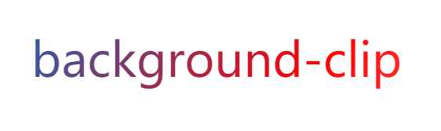

#### 实现文字颜色渐变有两种方法

1. 使用 background-clip 属性

```css
.text {
  background: linear-gradient(90deg, #326be6 0%, #0fcae2 100%);
  -webkit-background-clip: text;
  color: transparent;
}
```

##### 扩展

- background-clip,背景裁剪,作用就是设置背景的填充规则
  和 box-sizing 的取值非常类似，有三个值

```css
 {
  background-clip: border-box; /*背景延伸到边框外延，但是再边框之下*/
  background-clip: content-box; /*背景剪裁到内容区外沿*/
  background-clip: padding-box; /*背景延伸到内边距外沿*/
}
```

- background-clip: text; 只有 chrome 支持，需要写成 -webkit-background-clip:text
  以区块内的文字作为裁剪区域向外剪裁。文字的背景即为区块的背景，通常需要配合文字颜色设置为 transparent

示例：

```css
.text {
  color: transparent;
  border: 5px solid transparent;
  background: linear-gradient(120deg, #333 0%, #265fae 30%, red 60%, pink 100%);
  background-clip: content-box;
  -webkit-background-clip: text;
  font-size: 60px;
}
```

效果图:



2. 使用 mask-image 属性

示例

```css
.text {
  color: red;
  font-size: 60px;
  position: relative;
}
.text[data-content]::after {
  content: attr(data-content);
  display: block;
  color: yellow;
  z-index: 2;
  position: absolute;
  top: 0;
  left: 0;
  -webkit-mask-image: linear-gradient(180deg, yellow 0%, transparent 100%);
  mask-image: linear-gradient(180deg, yellow 0%, transparent 100%);
}
```
``` html
<div class="text" data-content="content">content</div>
```


其实就是将一个黄色到透明渐变的文字覆盖到本身红色的字上面，mask-image兼容性要高于第一种方法
