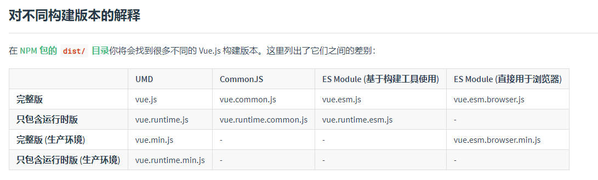
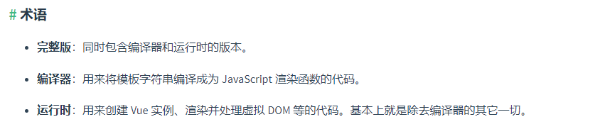

### 问题描述：使用vue+ant-design-vue时，因为Menu组件在V2.0之前不支持单文件递归，所以使用了函数式组件，但是编译时出现了下面的报错

```
[Vue warn]: You are using the runtime-only build of Vue where the template compiler is not available. Either pre-compile the templates into render functions, or use the compiler-included build.
```
翻译：您正在使用仅在运行时构建的Vue，其中模板编译器不可用。要么将模板预编译为呈现函数，要么使用包含编译器的构建。

#### 原因：

vue的构建版本分为：UMD， CommonJS，ES Module
[https://cn.vuejs.org/v2/guide/installation.html](https://cn.vuejs.org/v2/guide/installation.html)





vue默认的是运行时的版本，无法处理模板字符串的编译工作，需要使用包含编译器的构建

当需要客户端编译模板，如向template中传入一个字符串，或者需要将模板中的非DOM挂载到一个元素上时，就需要带有编译器（compiler）的构建版本。

而.vue文件中的模板会在构建时预编译（pre-compile）为JavaScript，最终生成的bundle中不再需要编译器，因此通常情况下只需要包含运行时（runtime-only）的构建版本

#### 解决方法
在项目目录下新建vue.config.js，添加配置，使用包含运行时编译器的构建版本

``` js 
module.exports = {
  //Solution For Issue:You are using the runtime-only build of Vue where the template compiler is not available. Either pre-compile the templates into render functions, or use the compiler-included build.
  runtimeCompiler: true
}
```