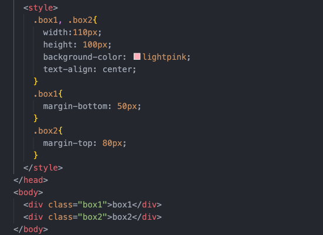
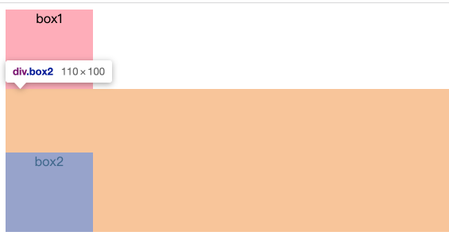

### 1、什么是BFC？
Formatting context：格式化上下文，它是页面中的一块渲染区域，并且有一套渲染规则，它决定了它的子元素将如何定位，以及和其他元素的关系和相互作用。

BFC（block-formatting-context）：块级格式化上下文。他是一个** 独立的渲染区域 **，具有BFC特性的元素可以看做是一块独立的容器，容器里面的元素不会在布局上影响到外面的元素，并且BFC具有普通容器所没有的一些特性。

### 2、触发BFC
主要元素满足以下任一条件即可触发BFC：
1. html根元素
2. 浮动元素：float除none以外的值
3. 绝对定位的元素：position值为absolute和fixed，即脱离文档流
4. display为inline-block、table-cells、flex的元素
5. overflow为除了visible以为的值，即hidden、scroll、auto

### 3、BFC的特性及应用
1. 同一个BFC下外边距会发生折叠
<div style="display:flex">
        
      
</div>
      
   从效果上看，因为两个div处于同一个BFC容器内，所以box1的下边距和box2的上边距发生了重叠，重叠的规则是取两个值中较大的值。
   ##### 如何避免这种情况呢？
   将两个div放在不同的BFC容器中。

2. BFC可以包含浮动的元素--清除浮动
   清除浮动的方法之一就是给父级元素设置`overflow:hidden`或者`overflow:auto`，这个方法的本质就是构建一个BFC容器。
   ##### 为什么构建BFC容器可以清除浮动呢？
   因为浮动的元素触发了自身的BFC，使普通布局变成了浮动布局，脱离文档流，而容器因为子元素的浮动产生塌陷，BFC会让容器内部回到普通布局。
   
   上图由于子元素浮动，导致父元素只省下边框的高度。此时，给父元素设置`overflow:hidden`，使其触发BFC，那么容器将会包裹住浮动元素，使浮动元素处于标准文档流中，如下图：
   
3. BFC可以阻止元素被浮动元素覆盖
   ```html
     <div>
      <div style="height: 100px; width: 100px; float: left; background: lightblue; opacity: 0.7">
        我是一个浮动元素
      </div>
      <div style="width: 200px; height: 200px; background: red">
        我没有设置浮动, 也没有触发 BFC 
      </div>
    </div>
   ```
   上面的代码会导致第二个元素被前面浮动的元素遮挡，效果如图：
   
   为了避免这种情况，我们可以给被遮挡的元素设置`overflow:hidden`，使其触发BFC
   ```html
 <div>
      <div style="height: 100px; width: 100px; float: left; background: lightblue; opacity: 0.7">
        我是一个浮动元素
      </div>
       <div style="width: 200px; height: 200px; background: red;overflow: hidden;">
        我触发了BFC
      </div> 
    </div>
   ```
   


