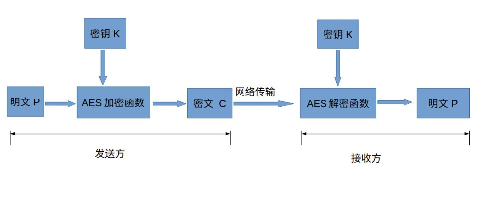

#### 背景

项目登录功能需要对密码进行加密，经前后端讨论后决定使用 aes 算法加密

#### 1.什么是 AES 加密？

AES advanced-encryption-standard，高级加密标准，是最为常见的对称加密算法。

##### 1.1 什么是对称加密算法？

对称加密算法就是加密和解密使用相同的密钥。
对称加密算法加密速度非常快，适合经常发送数据的场合，缺点是密钥的传输比较麻烦。

还有一种加密是**非对称加密**，加密和解密的密钥不同，由于加密和解密的速度较慢，通常适用于偶尔发送数据的场景。优点是密钥传输方便。常见的非对称加密算法有 RSA、ECC。

##### 1.2 加密流程



- 明文 P：没有经过加密的数据
- 密钥 K：可以理解为用来加密明文的密码，在对称加密算法中，加密和解密的密钥是相同的。通常是前后端协商好的一段字符串。如果需要传输密钥的话，千万不可以直接在网络上传输，否则会导致密钥泄露，通常的做法是将密钥经过非对称加密后，再发送给对方
- AES 加密函数：一个函数，输入明文和密钥，输出密文 C。C=E(K,P)
- 密文 C：经过加密函数处理过的数据
- AES 解密函数：一个函数，输入密文和密钥，输出明文 P。P=D(K,C)
  [参考文章](https://www.jianshu.com/p/a47477e8126a)

#### 2.具体实现

##### 2.1 安装 crypto-js

```
npm i crypto-js --save
```

##### 2.2 使用 crypto-js

在 utils 目录下的 index.js 中定义两个方法，encrypt 和 decrypt 分别用于加解密

```js
import CryptoJS from 'crypto-js'

export const encryption = (params) => {
  let { data, type, param, key } = params
  const result = JSON.parse(JSON.stringify(data))
  if (type === 'Base64') {
    param.forEach((ele) => {
      result[ele] = btoa(result[ele])
    })
  } else {
    param.forEach((ele) => {
      key = CryptoJS.enc.Latin1.parse(key)
      var iv = key
      // 加密
      var encrypted = CryptoJS.AES.encrypt(result[ele], key, {
        // iv：初始向量，不同的iv加密后的字符串是不同的，加密和解密需要相同的iv
        // iv和key的区别：对于每个块来说，key是相同的，但是只有第一个块的iv是用户提供的，其他块的iv都是自动生成的
        // iv的长度为16个字节，超过或者不足16个字节时，crypto库会自动进行补齐或者截断
        iv: iv,
        // mode：加密模式，通常有ECB、CFB、CBC等，区别是ECB没有使用iv，相对来说没有其他模式安全。
        mode: CryptoJS.mode.CFB,
        // padding：用来填充最后一块的模式，通常有NoPadding、PKCS5、PKCS7、ZeroPadding
        padding: CryptoJS.pad.NoPadding
      })
      result[ele] = encrypted.toString()
    })
  }
  return result
}
console.log(
  encryption({ data: { username: 'admin', password: '123456' }, key: '1234123412ABCDEF', param: ['password'] })
)
/**
 * 解密
 * @param {*} params
 */
export const decryption = (params) => {
  let { data, type, param, key } = params

  const result = JSON.parse(JSON.stringify(data))
  param.forEach((ele) => {
    key = CryptoJS.enc.Latin1.parse(key)
    let iv = key
    const decrypted = CryptoJS.AES.decrypt(result[ele], key, {
      iv: iv,
      mode: CryptoJS.mode.CFB,
      padding: CryptoJS.pad.NoPadding
    })
    result[ele] = decrypted.toString(CryptoJS.enc.Utf8).toString()
  })
  return result
}

console.log(
  decryption({
    data: { username: 'admin', password: 'wTcp2iOf' },
    key: '1234123412ABCDEF',
    param: ['password']
  })
)
```

**踩坑**：当加密解密的 padding 都为 NoPadding 时，发现解密后生成 utf8 字符串出错

将解密的 mode 改为 CBC，padding 改为 Pkcs7 即可正常解密


<!-->

```flow
st=>start: 明文P
end=>end: 明文P
op1=>operation: AES加密函数|current
op2=>operation: 密文C|current
op3=>operation: AES解密函数|current
op4=>operation: 密钥K|current
st(right)->op1(right)->op4->op2(right)->op3(right)->end
op4->op1
op4->op3
```

<--!>
